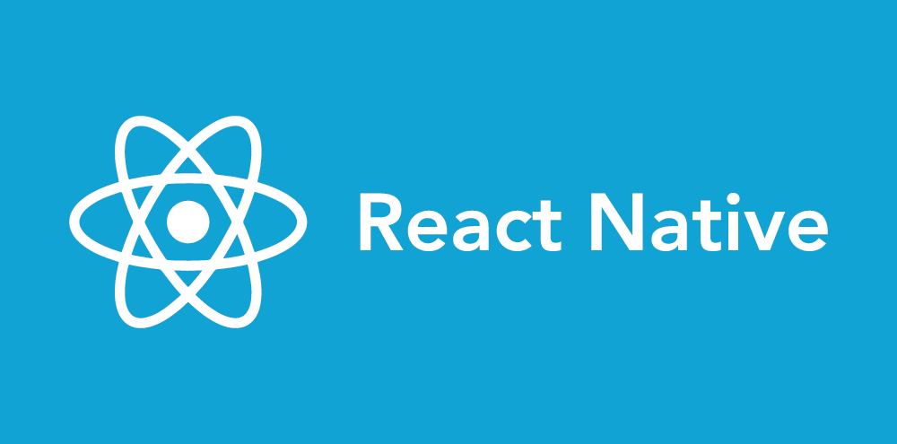

# React (Web + Native) Starter Kit



P.C.: [IMG](https://www.jameelmukadam.com/blog/simple-react-native-setup-guide-for-mac)

## 👋 Intro

This boilerplate launches with a [React Native app](https://facebook.github.io/react-native/). It shares the 'business logic' (_i.e. actions, containers, reducers_) across the platforms, whilst allowing flexibility in View components to ensure your project looks and feels native in each platform.

The project is _super_ helpful to kick-start your next project, as it provides a lot of the common tools you may reach for, all ready to go.  We’ll cover

- Scrolling lists
- Designing and creating reusable components
- Project organization
- Navigation
- Core APIs
- Installing third party packages
- And more…

And we’ll do this for both **iOS and Android.**

---

## 🚀 Getting Started

#### 1. Clone and Install

_*It's recommended that you install [React Native Debugger](https://github.com/jhen0409/react-native-debugger/releases) and open before `npm start`._

```bash
# Clone the repo
git clone https://github.com/knaxus/ReactNative-ContactsApp.git

# cd into the diectory
cd ReactNative-ContactsApp

# Install dependencies
npm i
```

#### 2.1. Run the _React Native_ App

```bash
# Start the React Native packager
npm start

or

# After opening an AVD in emulator or connecting a physical device
# For Android 
react-native run-android

# For iOS
react-native run-ios
```

Instructions are shown in the terminal. You can select to open it in:

- An emulator (either iOS or Android)
- Your mobile device with the [Expo app](https://expo.io/). It will reload if you save edits to your files and you will see build errors and logs in the terminal.

---

## 👊 Further Help?

This repo is a great place to start, but if you'd prefer to sit back and have your new project built for you, [get in touch with me directly](mailto:geekankit318@gmail.com) and I can organise a quote.

---

## 💡 Inspiration

- [This Udemy Course](https://www.udemy.com/create-your-first-react-native-app/) helped put the ideas into action.

_If there's any other ideas presented in this repo, that you think worth mentioning - feel free open a pull request :)_
